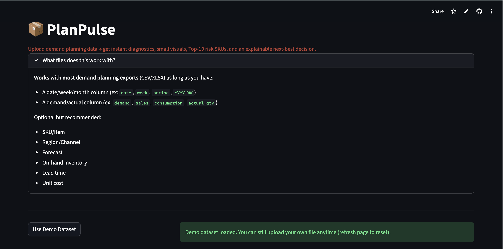
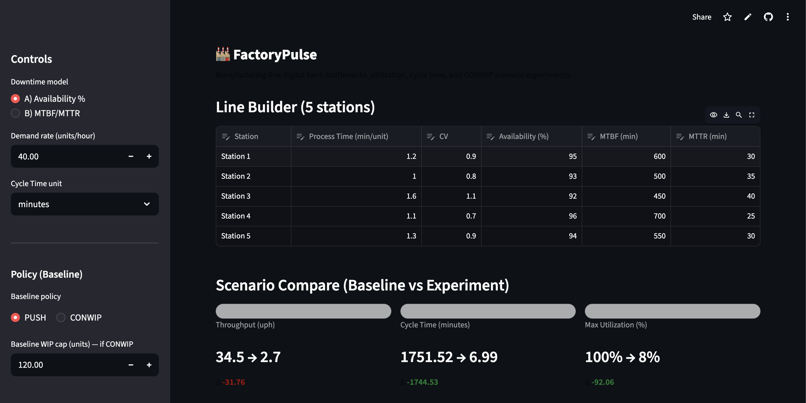
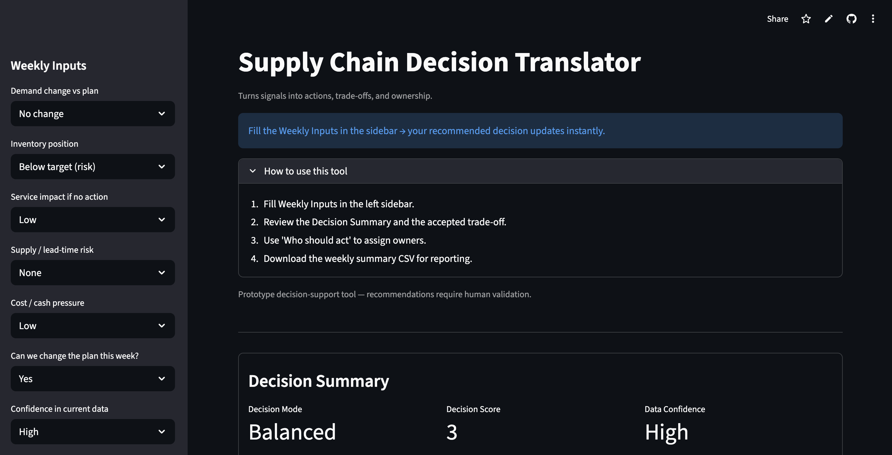

Toggle dark mode

  
  

    <h1>Rutwik Satish</h1>
    
<strong>Supply Chain and Operations Analyst</strong> 
    Inventory, Planning, and Flow Decision Systems

  

I am a graduate student in Engineering Management at Northeastern University with one year of hands-on internship experience across logistics and industrial engineering.

Beyond my internships, I research real-world supply chain problems such as inventory imbalance, planning noise, and execution delays, and I build decision-support systems that translate operational data into clear, actionable decisions.

---

## Experience

<strong>Mercedes-Benz R and D India</strong> 
Industrial Engineering Intern

<ul>
<li>Analyzed performance data across 25+ production assets, identifying recurring fault patterns impacting downstream availability</li>
<li>Supported root-cause analysis initiatives contributing to an approximate 10 % reduction in repeat operational issues</li>
<li>Built standardized Excel KPI dashboards, improving reporting accuracy by approximately 30 % </li>
<li>Assisted PPAP-aligned documentation to support planning reliability</li>
</ul>

<strong>Ativegh Logistics Pvt. Ltd.</strong> 
Logistics Intern

<ul>
<li>Conducted SKU-level inventory and material flow analysis, contributing to an approximate 15 % increase in service levels</li>
<li>Reduced working capital by approximately 10 % through replenishment analysis</li>
<li>Improved execution efficiency by approximately 8 % through KPI tracking</li>
<li>Supported Tableau dashboards that accelerated execution cycles by approximately 20 % </li>
</ul>

---

## Flagship Project - PlanPulse

<strong>PlanPulse - Demand Planning Auto Analyst</strong>

<strong>Problem</strong> 
Planners monitor hundreds of SKUs, but risk is uneven. This leads to reactive firefighting and excess inventory.

<strong>Solution</strong> 
A decision-support system that prioritizes SKUs based on demand volatility, inventory exposure, and service risk.

<strong>What it delivers</strong>

<ul>
<li>Ranks SKUs by true operational risk</li>
<li>Quantifies service versus inventory versus cash trade-offs</li>
<li>Recommends next-best planning actions</li>
</ul>

<a href="https://planpulse.streamlit.app/" target="_blank">View Live Application</a>

---

## Other Projects

<strong>FactoryPulse - Production Flow Simulator</strong> 
<a href="https://factorypulse.streamlit.app/" target="_blank">View Application</a>

<strong>Supply Chain Decision Translator</strong> 
<a href="https://scdt-app.streamlit.app/" target="_blank">View Application</a>

<strong>Adaptive Supply Chain Decision Engine</strong> 
<a href="https://public.tableau.com/views/AdaptiveSupplyChainDecisionEngineASCDEEVPlanningPrioritization/AdaptiveSupplyChainDecisionEngineASCDE" target="_blank">
View Tableau Dashboard
</a>

---

## Skills

<strong>Supply Chain and Operations</strong>
<ul>
<li>Inventory Management and Replenishment</li>
<li>Demand Variability and Forecast Risk</li>
<li>Material Flow and Bottleneck Analysis</li>
<li>Warehouse Operations</li>
</ul>

<strong>Analytics and Tools</strong>
<ul>
<li>Python, SQL</li>
<li>Advanced Excel</li>
<li>Tableau</li>
<li>AutoCAD</li>
<li>ERP-style data analysis</li>
</ul>

---

## Contact

Email: <a href="mailto:satish.ru@northeastern.edu">satish.ru@northeastern.edu</a> 
LinkedIn: <a href="https://www.linkedin.com/in/rutwiksatish/" target="_blank">linkedin.com/in/rutwiksatish</a> 
GitHub: <a href="https://github.com/RutwikSatish" target="_blank">github.com/RutwikSatish</a>
